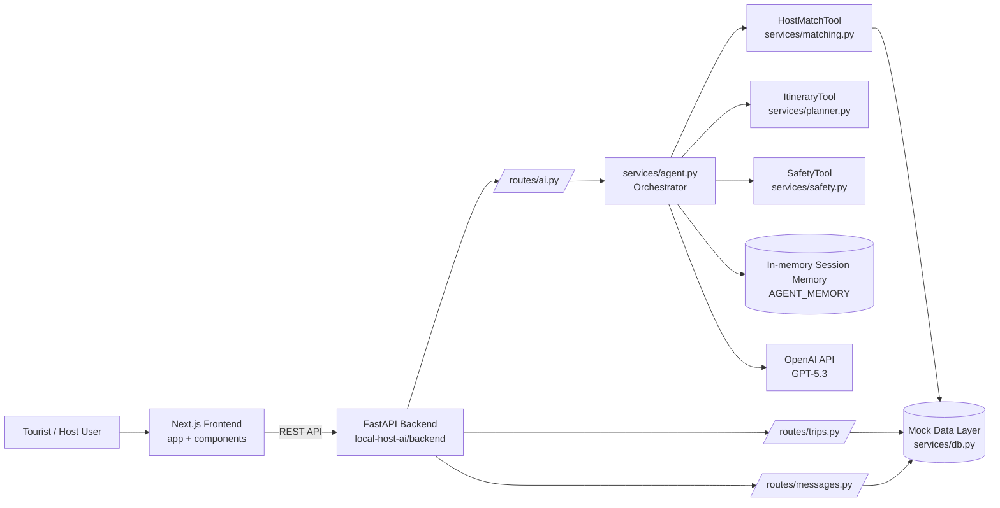

# Traverse Architecture

## High-Level Diagram

## Data / Request Flow

1. User sends travel request from chat UI.
2. Frontend calls `POST /ai/agent-chat`.
3. `services/agent.py` extracts intent, city, interests, budget, and routes tool calls.
4. Host matching, itinerary generation, and safety checks run as tools.
5. Structured response returns:
   - `intent`
   - `selected_tools`
   - `host_candidates`
   - `itinerary_days`
   - `safety_flags`
   - `next_actions`
6. Frontend renders result cards and action guidance.

## Deployment Architecture

- Frontend: Vercel (Next.js)
- Backend: Render (FastAPI)
- CORS controlled via `ALLOWED_ORIGINS`
- Optional external model provider: OpenAI
